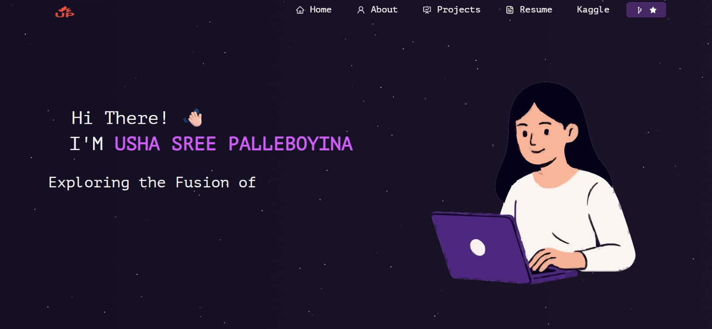

<h2 align="center">
  Portfolio Website - v2.0<br/>
  <a href="https://usha193.github.io/portfolio" target="_blank">usha193.github.io/portfolio</a>
</h2>

<div align="center">
  
</div>

<br/>

<center>

[](https://forthebadge.com) &nbsp;
[](https://forthebadge.com) &nbsp;
[](https://forthebadge.com) &nbsp;
 &nbsp;


</center>

<h3 align="center">
    🔹
    <a href="https://github.com/Usha193/portfolio/issues">Report Bug</a> &nbsp; &nbsp;
    🔹
    <a href="https://github.com/Usha193/portfolio/issues">Request Feature</a>
</h3>

---

## 🚀 TL;DR

You can fork this repo and modify it for your own use.  
Please give proper credit by linking back to [Usha193](https://github.com/Usha193).  
Built and customized with ❤️ by **Usha Sree Palleboyina**.

---

## 🛠️ Built With

My personal portfolio <a href="https://usha193.github.io/portfolio" target="_blank">usha193.github.io/portfolio</a>  
showcases my **projects, technical skills, research, and resume**, reflecting my journey in **Software Engineering, AI, and Data Science**.

This project is built using:

- ⚛️ React.js  
- 🟢 Node.js  
- 💜 React-Bootstrap & CSS3  
- 💻 VsCode  
- ☁️ GitHub Pages / Vercel  

---

## ✨ Features

**📖 Multi-Page Layout** — Home, About, Projects, Resume  
**🎨 Modern UI** — Styled with React-Bootstrap and custom CSS (easily customizable colors)  
**📱 Responsive Design** — Fully optimized for desktop and mobile  
**💡 Dynamic Projects Section** — Displays my top 5 GitHub projects automatically  
**🧠 Clean, Modular Codebase** — Easy to modify and extend  

---

## ⚙️ Installation and Setup Instructions

To get started locally:

1. Clone the repository:
   ```bash
   git clone https://github.com/Usha193/portfolio.git
   ```

2. Install dependencies:
   ```bash
   npm install
   ```

3. Start the local development server:
   ```bash
   npm start
   ```

4. Open your browser and visit:
   ```
   http://localhost:3000
   ```

---

## 🚢 Deployment

To deploy your version on GitHub Pages:

```bash
npm run deploy
```

Your site will be live at  
👉 **https://Usha193.github.io/portfolio**

---

## 🧭 Usage

- Navigate to `/src/components/` to edit your sections:
  - `Home.js` → Intro banner and tagline  
  - `About.js` → Personal summary and skills  
  - `Projects.js` → Add or edit project cards  
  - `Resume.js` → Update resume link and buttons  

---

## 🧩 Highlighted Projects

| Project | Description | GitHub Link |
|----------|-------------|-------------|
| 🌎 **RTS ArcticDEM Analysis** | Deep learning segmentation (Mask R-CNN) for Arctic permafrost monitoring using DEM time-series | [RTS Project](https://github.com/Usha193/RTS) |
| 🗣 **NLP-Based Virtual Interviewer** | AI-driven voice-based interview simulator with feedback | [Virtual Interviewer](https://github.com/Usha193/virtual-interviewer) |
| 🔐 **Sensitive Data Redaction & Crime Prediction** | NLP + ML dashboard for PII redaction and crime forecasting | [Crime Prediction](https://github.com/Usha193/crime-prediction) |
| 🎵 **Topological Music Explorer & Culture Detector** | TDA-based music visualization and cultural classification | [Music Culture Detection](https://github.com/Usha193/music_culture_detection) |
| 🌿 **Plant Disease Detection (Deep Learning)** | CNN and transfer learning (VGG16, ResNet34) for plant disease identification | [Plant AI](https://github.com/Usha193/plant_disease_detection) |

---

## 💜 Show Your Support

Give this repo a ⭐ if you like the design and customization!

<a href="https://www.buymeacoffee.com/usha193" target="_blank">
  
</a>

---

### 👩‍💻 Author

**Usha Sree Palleboyina**  
📍 Gainesville, Florida  
📧 [ushasreepalleboyina@gmail.com](mailto:ushasreepalleboyina@gmail.com)  
🔗 [LinkedIn](https://www.linkedin.com/in/usha-sree-palleboyina-002810207/) • [GitHub](https://github.com/Usha193)

---